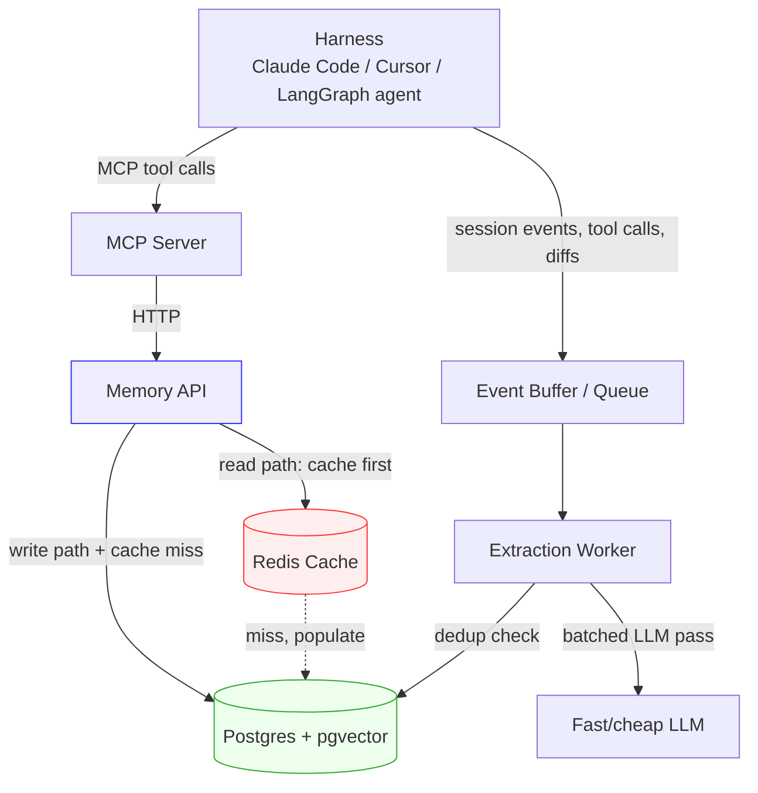

# Architecture

## Components

- **Harness** — Claude Code, Cursor, or any MCP-compatible agent. Emits events
  (messages, tool calls, diffs) and calls `remember`/`recall`/`forget` as MCP tools.
- **MCP Server** (Python) — thin protocol adapter. Translates MCP tool calls into
  HTTP calls against the Memory API. Owns no state.
- **Memory API** (Python, FastAPI) — the actual product. Owns retrieval scoring,
  caching, dedup, and the write path.
- **Redis** — read-through cache in front of the vector search, keyed on
  `(org_id, query_hash)` or similar. This is what makes recall fast.
- **Postgres + pgvector** — source of truth: memory content, embeddings, metadata.
  Full schema in `spec/06-database.md`.
- **Extraction Worker** — background job/process consuming buffered harness events,
  running a batched LLM extraction pass, deduping against existing memories, and
  writing new ones. Fully async — never blocks a harness turn.

## Diagram

## Key architectural decisions
- **Read path is synchronous and cache-first**; write/extraction path is fully
  async — recall latency must never depend on extraction latency.
- **MCP server holds no state** — it's a pure adapter, so it can be redeployed,
  horizontally scaled, or swapped for a different transport (REST SDK, LangChain
  tool) without touching the Memory API.
- **Stateless implies no session affinity.** Because any MCP server instance can
  handle any request, every `remember`/`recall`/`forget` tool call must carry full
  identity context explicitly (`org_id`, `session_id`, auth token) as arguments —
  never inferred from a prior call. The server does not "remember who's calling"
  between invocations; the Memory API is the only source of truth for identity
  and history.
- **Single Postgres instance for MVP** — pgvector avoids running a separate vector
  DB alongside relational metadata; revisit only if scale demands it.
- **org_id scoping enforced at the query layer**, not just the API layer, so a bug
  in a route handler can't leak cross-tenant data.
