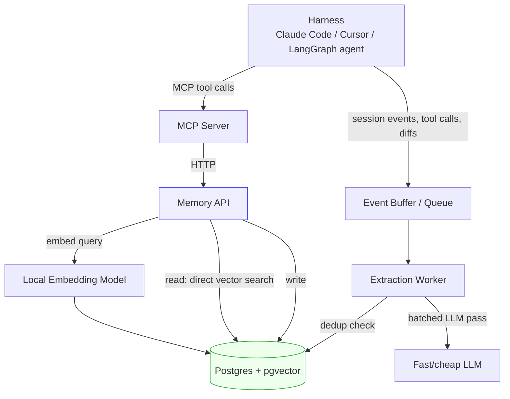

# Architecture

## Components

- **Harness** — Claude Code, Cursor, or any MCP-compatible agent. Emits events
  (messages, tool calls, diffs) and calls `remember`/`recall`/`forget` as MCP tools.
- **MCP Server** (Python) — thin protocol adapter. Translates MCP tool calls into
  HTTP calls against the Memory API. Owns no state.
- **Memory API** (Python, FastAPI) — the actual product. Owns retrieval scoring,
  dedup, and the write/update path. Reads query Postgres directly — no cache layer.
- **Embedding Model (local, in-process)** — small (~20-100M param) embedding
  model loaded directly in the Memory API process, used to embed the query on
  every recall. No network call to a hosted embedding API — with no cache
  absorbing that cost, this is now the single biggest lever on read latency.
- **Postgres + pgvector** — source of truth: memory content, embeddings, metadata.
  Full schema in `spec/06-database.md`. Serves reads directly.
- **Extraction Worker** — background job/process consuming buffered harness events,
  running a batched LLM extraction pass, deduping against existing memories, and
  writing new ones. Fully async — never blocks a harness turn.

## Hybrid stores (v2 Phase 1–3)

KV stays on by default (`MEMORIA_ENABLE_KV=true`). `kv_facts` is a secondary
index; search unions exact KV hits with vector hits. See
`spec/v2-phase1-kv-store.md`.

Graph is also on by default (`MEMORIA_ENABLE_GRAPH=true`). `graph_nodes` and
`graph_edges` store relationship triples with soft-invalidation: a new edge for
the same `(org, subject, relation)` marks prior edges invalid (never deleted).
Search unions 1–2 hop graph-linked memories with vector and KV hits;
`relevance = max(vector_similarity, kv_match, graph_score)` where 1-hop
`graph_score` is 1.0 and 2-hop is 0.5. Optional `as_of` on search queries
historical valid edges. See `spec/v2-phase2-graph-store.md`.

`HybridRetriever` (`memory_api.services.hybrid_search`) fans Vector, KV, and
Graph reads out concurrently (`ThreadPoolExecutor`). Ranking is unchanged.
`GET /memories/search?explain=true` returns per-hit `score_details` (`sources`,
`kv_match`, `graph_hops`) and request-level `timings_ms` (`embed`, `vector`,
`kv`, `graph`, `total`). Set `MEMORIA_ENABLE_KV=false` or
`MEMORIA_ENABLE_GRAPH=false` to disable each store independently. See
`spec/v2_extension_plan.md`, `spec/v2-phase0-foundations.md`, and
`spec/v2-phase3-fusion.md`.

## Why no cache layer
A cache was in the original design to absorb repeated-query latency, but it
introduces its own overhead — invalidation logic, an extra service to run and
reason about, and a second thing that can be wrong (stale results). We dropped
it in favor of making the direct-query path itself fast enough that a cache
isn't load-bearing:
- Embeddings are computed in-process (no external API round-trip)
- pgvector index is tuned specifically for this access pattern (see below)
- `org_id`/`session_id` composite indexing keeps the candidate set small before
  the vector search even runs

If p95 latency measurements (tracked from Phase 1 per `spec/00-plan.md`) show
this isn't fast enough at real data volumes, an in-memory result cache is a
reasonable fast-follow — but it's opt-in complexity added only if the numbers
demand it, not a default.

## Diagram

## Key architectural decisions
- **Read path is synchronous, direct against Postgres+pgvector** — no cache
  layer; write/extraction path is fully async regardless.
- **MCP server holds no state** — it's a pure adapter, so it can be redeployed,
  horizontally scaled, or swapped for a different transport (REST SDK, LangChain
  tool) without touching the Memory API.
- **Stateless implies no session affinity.** Because any MCP server instance can
  handle any request, every `remember`/`recall`/`forget` tool call must carry full
  identity context explicitly (`org_id`, `session_id`, auth token) as arguments —
  never inferred from a prior call. The server does not "remember who's calling"
  between invocations; the Memory API is the only source of truth for identity
  and history.
- **Single Postgres instance for MVP** — pgvector avoids running a separate vector
  DB alongside relational metadata; revisit only if scale demands it.
- **org_id scoping enforced at the query layer**, not just the API layer, so a bug
  in a route handler can't leak cross-tenant data.
- **Embedding generation happens locally, in-process, never over the network** —
  the biggest single latency lever now that there's no cache in front of it.
