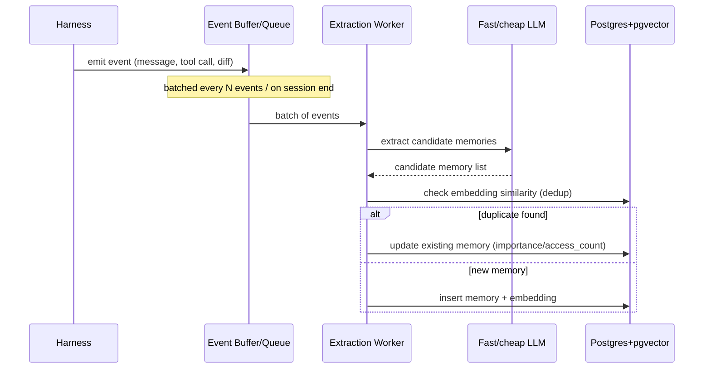
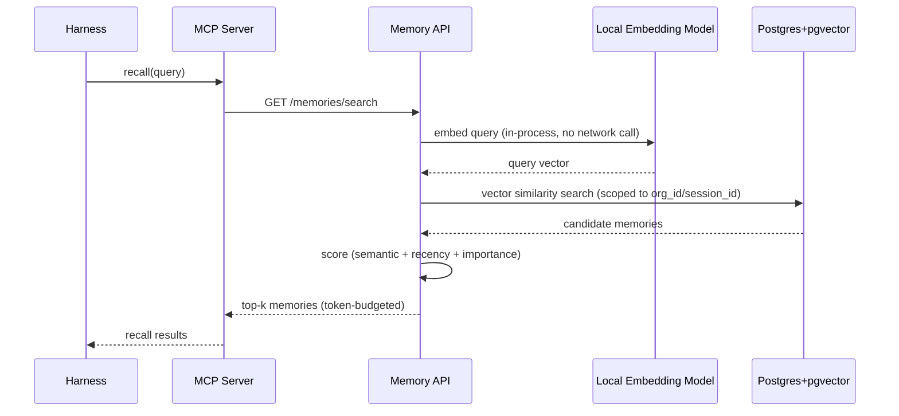
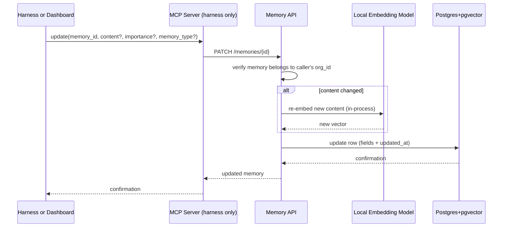

# Workflow & Dataflow

## Write path (async, off the hot path)

Events are buffered and processed in batches — never per-message — to keep the
harness loop unaffected by extraction cost.

## Read path (sync, latency-critical)

Direct against Postgres+pgvector, no cache layer. This is the path that must
stay fast, since it sits directly in the harness's turn loop — the two levers
for that are the in-process embedding model (no network round-trip) and a
well-tuned pgvector index (see `spec/06-database.md`), not a cache.

## Update path (sync, explicit correction)

A direct way to fix a memory's content or metadata — separate from the extraction
worker's implicit dedup-driven updates. Useful for a harness correcting something
it got wrong, or a human editing from the dashboard.

Note: the dashboard calls `PATCH /memories/{id}` directly (session-JWT
authenticated, no MCP hop needed) since it's already talking to the Memory API.

## Data lifecycle notes
- `last_accessed_at` and `access_count` update on every successful recall — this
  feeds the importance weight in scoring and the consolidation job's decisions.
- Memories with no access over a defined window are candidates for decay/archival
  (fast-follow, not required for MVP correctness).
- With no cache, every recall is a live query — this is intentional (see
  `spec/03-architecture.md` for why the cache was dropped) and means results
  are always current, no staleness/invalidation logic to maintain.
