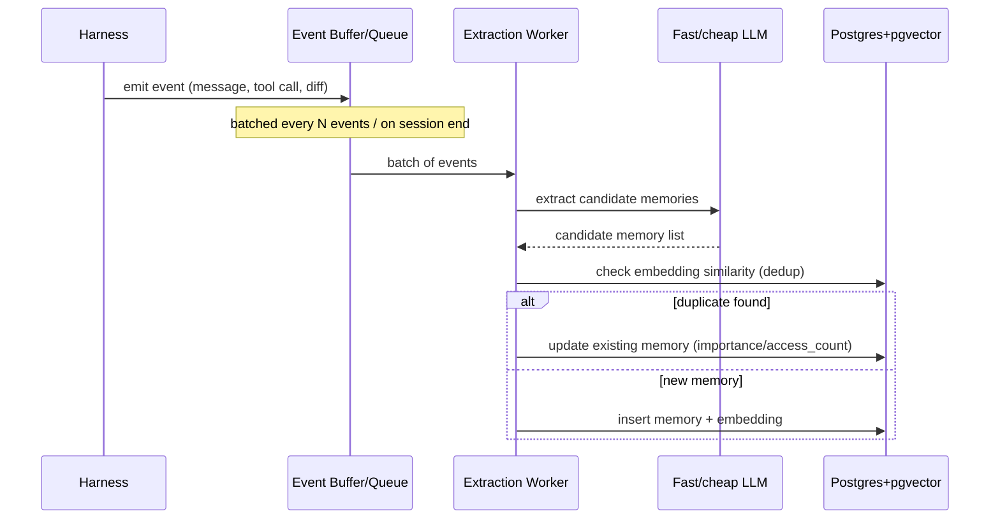
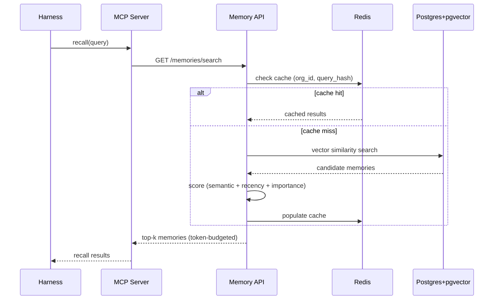

# Workflow & Dataflow

## Write path (async, off the hot path)

Events are buffered and processed in batches — never per-message — to keep the
harness loop unaffected by extraction cost.

## Read path (sync, latency-critical)

Cache-first. This is the path that must stay fast, since it sits directly in the
harness's turn loop.

## Data lifecycle notes
- `last_accessed_at` and `access_count` update on every successful recall — this
  feeds the importance weight in scoring and the consolidation job's decisions.
- Memories with no access over a defined window are candidates for decay/archival
  (fast-follow, not required for MVP correctness).
- Cache entries are invalidated (or short-TTL'd) on any write to the same
  `org_id`/`session_id` to avoid serving stale recall results.
