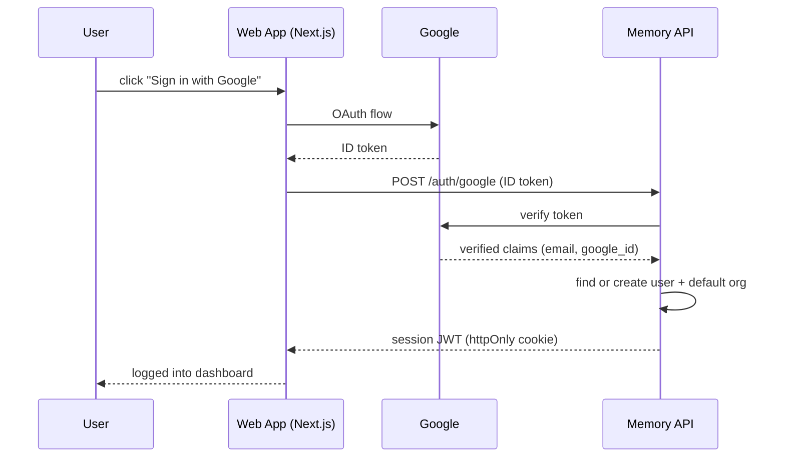
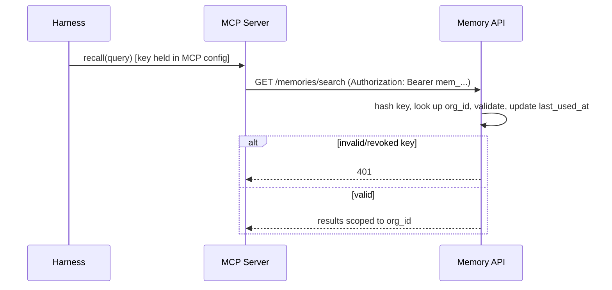

# Auth

Two distinct auth mechanisms, for two distinct callers:

| Caller | Mechanism | Used for |
|---|---|---|
| Human (browser, web dashboard) | Google OAuth → session JWT | Login, managing org, generating/revoking API keys, viewing memories |
| Machine (MCP server → Memory API) | API key → Bearer token | `remember`/`recall`/`forget` calls, stays stateless (unchanged from before) |

The Memory API is the source of truth for both — the web app never owns user/org
data independently, it just drives the OAuth flow and holds the resulting session.

## Human auth: Google OAuth

- Web app (`apps/web`) initiates Google OAuth (Auth.js/NextAuth on Next.js)
- On successful Google login, web app sends the Google ID token to the Memory API
- Memory API verifies the token against Google, then:
  - looks up `users` by `google_id` — creates the user (and a default `org`) if new
  - issues a short-lived session JWT, returned to the web app as an httpOnly cookie
- All subsequent dashboard calls (list memories, manage keys, org settings) use
  that session JWT — this is a normal authenticated-user flow, not the stateless
  MCP path
- Memory API owns this because API keys, org membership, and OAuth identity all
  need to live in one place — the web app is just a client of it

## Machine auth: API keys

- Generated from the dashboard by an authenticated (Google OAuth) user, scoped to
  their org
- Single key format for MVP — `mem_...`, one key per org (no live/test split;
  that's unnecessary complexity until there's an actual need for environment
  separation). Last 4 characters stored (`key_last4`) for display in the dashboard;
  the rest is never stored or shown again after creation.
- Hashed at rest — never stored plaintext
- Placed into the harness's MCP client config; sent as a `Bearer` token on every
  `remember`/`recall`/`update`/`forget` call
- Memory API validates the key on every request (no session, since the MCP server
  is stateless) → resolves `org_id` → enforces tenant isolation at the query layer
- `last_used_at` updated on each successful validation — powers the dashboard's
  "last used" column
- Rate limiting keyed to the API key, not IP

## Data model additions
- `users` — id, google_id, email, name, org_id, created_at
- `orgs` — id, name, created_at
- `api_keys` — id, org_id, created_by_user_id, key_hash, key_last4, revoked_at,
  last_used_at, created_at. Full column notes in `spec/06-database.md`.

## MVP scope
- [ ] Google OAuth app registration (client ID/secret)
- [ ] `POST /auth/google` — verify ID token, find-or-create user + org, issue session JWT
- [ ] Session JWT validation middleware (separate from API key middleware) for dashboard routes
- [ ] `users` / `orgs` tables + migrations
- [ ] Dashboard: login page, key management page (create/revoke), org settings
- [ ] `api_keys` table + hashing/validation middleware, `last_used_at` update on auth
- [ ] Rate limiting keyed to API key

## Fast-follow (not MVP-blocking)
- Multiple users per org with roles (owner/member)
- Per-key scopes (read-only vs read-write)
- Live/test key environments, if a real need for it shows up
- Key rotation UI, usage/audit log per key
- Additional OAuth providers beyond Google
